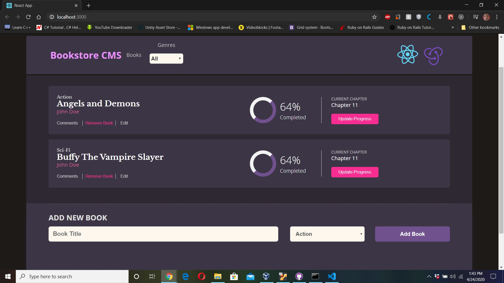

# Microverse Project Title - Bookstore CMS

[Collaborative Project]
React-Redux

### Snapshot

### Introduction.
In this project you will use React and Redux to build a very simple application. You will work in a real-world project for a fictional company that requires your help. The project has been split into multiple milestones, and each milestone has functional and technical requirements that you will need to implement.

#### [Original Project Specifications Here](https://github.com/microverseinc/project-redux-bookstore)

### Project Objectives

Magic-books Inc. is a fictional company based in Germany. They have requested your help to build the front-end of an application that will help them organize and manage their bookstore. They want it to be fast, dynamic and responsive to their actions and therefore you decided to build it with React & Redux.

## Built With

- HTML, CSS
- [ES6 JavaScript](https://developer.mozilla.org/en-US/docs/Web/JavaScript)
- [Node Package Manager(NPM)](https://www.npmjs.com/)
- [React-Create-App](https://github.com/mars/create-react-app-buildpack)
- [Redux](https://redux.js.org/)
- [Prop-types](https://www.npmjs.com/package/prop-types)

### To begin

1. Clone Repo
2. 'npm install' to install dependencies
3. `yarn start` or 'npm start' on terminal
4. Open [http://localhost:3000](http://localhost:3000) to view it in the browser.

## [Live DEMO](https://arn-react-redux-bookstore.netlify.app/)

#### Getting Started
Clone repo and open index.html with your favorite browser.

#### Prerequisites
Web browser like Chrome, Mozilla or similar.

## Authors

👤 **Gerald Goh**
- Github: [geraldgsh](https://github.com/geraldgsh)
- Twitter: [geraldgsh](https://twitter.com/geraldgsh)
- Linkedin: [Gerald Goh](https://www.linkedin.com/geraldgsh)

👤 **Aaron Rory**

- Github: [@Aaron-RN](https://github.com/Aaron-RN)
- Twitter: [@ARNewbold](https://twitter.com/ARNewbold)
- Linkedin: [Aaron Newbold](https://www.linkedin.com/in/aaron-newbold-1b9233187/)

## 🤝 Contributing
Contributions, issues and feature requests are welcome!

Feel free to check the [issues page](https://github.com/geraldgsh/redux-bookstore/issues).

## Show your support

Give a ⭐️ if you like this project!

## Acknowledgments

- Hat tip to anyone whose code was used
- Inspiration
- etc

## 📝 License

This project is [MIT](lic.url) licensed.
